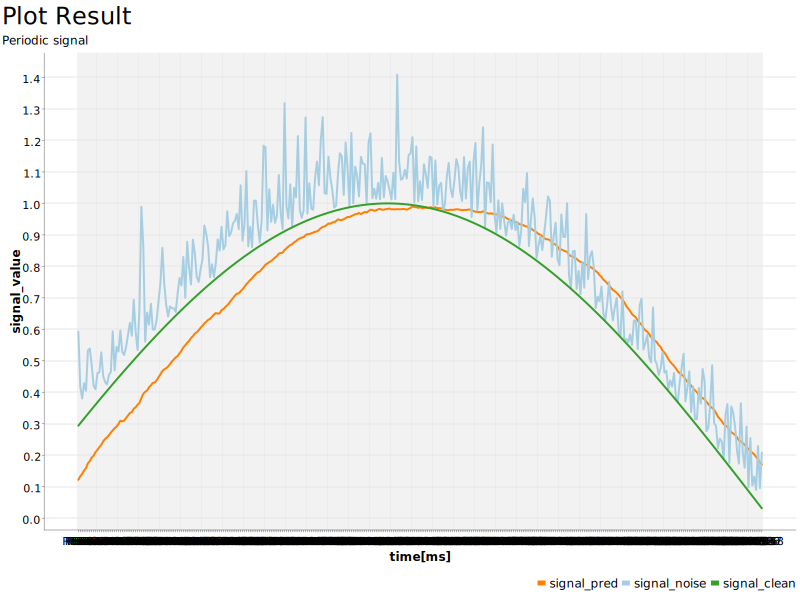
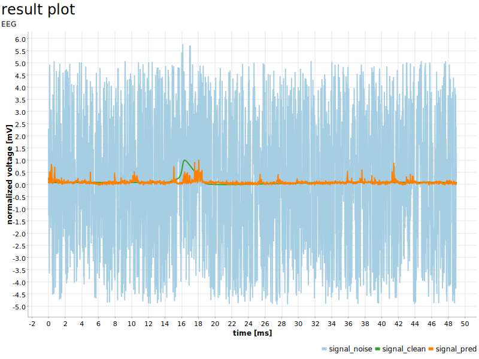

# Knime-Autoencoder-project-CNR

# Istruzioni per utilizzare i file Knime

- installare knime ( link: https://www.knime.com/downloads )
- aprire l'applicazione e creare un nuovo workspace dove si preferisce nella memoria del pc, 
  in modo da avere uno spazio dove far girare e eventualmente salvare i progetti 
- scaricare sul proprio computer i file presente nella repository
- aprirli cliccando con il tasto destro sulla loro icona, selezioare apri con,
  selezionare Knime se gia presente se no puntare all'avviabile nella sua cartella di installazione.
  In alternativa aprire direttamento dall'app di Knime andando sulla tendina in alto a sinistra file/import Knime workflow/browse e selezionare il file da aprire 
- Knime vi chiederà quale workspace aprire tramite percorso file, punterà automaticamente all'ultima workspace aperta
- una volta aperto il file su Knime vi chiederà il programma di installare le estenzioni necessarie a leggere tutti i nodi del progetto, 
  date il consenso a tutte le installazioni. Una volta conclusa l'installazione chiudete e riavviate Knime, ora potete lavorare sul framework liberamente 

## Project autoencoder for periodic signals

# Knime Workflow

# Result Image

## Project autoencoder for EEG signals

# Knime Workflow

# Result Images

FIRST CASE:

SECOND CASE:

THIRD CASE:

FOURTH CASE: (Ho provato a togliere la tecnica SNR e fare 2 rumori casuali con distribuzione gaussiana a devianza fissa a 10 con un range da –5 a 5 riallenando la macchina con un nuovo tipo di rumore e tenendo il segnale target tra 0 e 1 e osservando che la loss tende a 0 )

FIFTH CASE: (Ho provato a fare come prima ma copiando nel test noise lo stesso seed del training)

SIXTH CASE: (Ho Provato a rimettere la teoria SNR ma moltiplicando per 100 il valore medio del rumore risultante dalle operazioni (solo per il test), testando, però, la prima rete che avevo allenato con valori normali di rumore (senza il X100)) 

SEVENTH CASE: (Ho riallenato la rete una 3a volta con il valore medio della potenza del rumore X100) 

#PARTICOLARI 2o e 3o ALLENAMENTO
Ho tenuto sempre lo stesso numero di epoche (100).
La LOSS tende a 0 in tutti i e 2 gli allenamenti in modo non tanto differente dalla prima volta.
Il tempo impiegato è sempre 3 minuti. 
Ho salvato queste altre 2 reti in formato tensorflow invece che nel formato keras notando che nel test la loro lettura dall'executor è molto più veloce.

