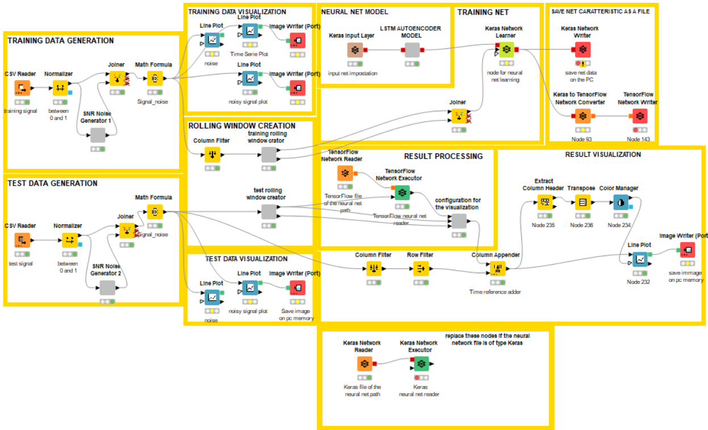

# Autoencoder-project-CNR-

# Istruzioni per utilizzare i file Knime

- installare knime ( link: https://www.knime.com/downloads )
- aprire l'applicazione e creare un nuovo workspace dove si preferisce nella memoria del pc, 
  in modo da avere uno spazio dove far girare e eventualmente salvare i progetti 
- scaricare sul proprio computer i file presente nella repository
- aprirli cliccando con il tasto destro sulla loro icona, selezioare apri con,
  selezionare Knime se gia presente se no puntare all'avviabile nella sua cartella di installazione.
  In alternativa aprire direttamento dall'app di Knime andando sulla tendina in alto a sinistra file/import workspace/browse e selezionare il file da aprire 
- Knime vi chiederà quale workspace aprire tramite percorso file, punterà automaticamente all'ultima workspace aperta
- una volta aperto il file su Knime vi chiederà il programma di installare le estenzioni necessarie a leggere tutti i nodi del progetto, 
  date il consenso a tutte le installazioni. Una volta conclusa l'installazione chiudete e riavviate Knime, ora potete lavorare sul framework liberamente 

## Project autoencoder for periodic signals

# Knime Workflow

# Result Image

## Project autoencoder for EEG signals

# Knime Workflow

# Result Images

FIRST CASE:

SECOND CASE:

THIRD CASE:

